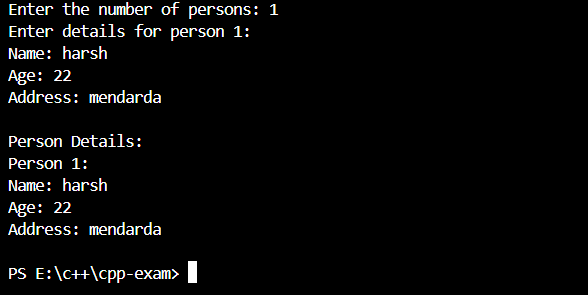
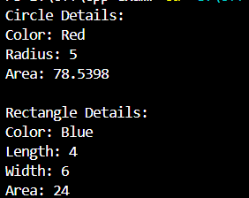
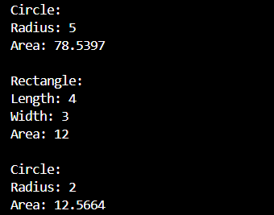
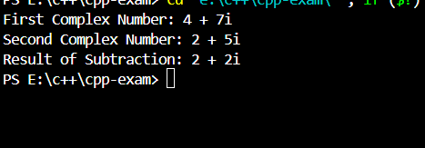
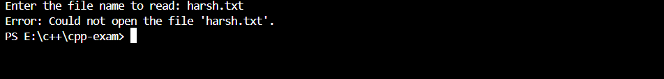
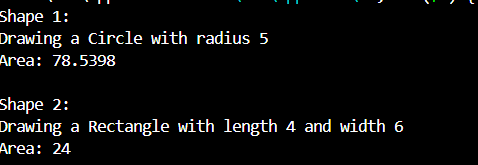

<h1 align="center">Cpp Programs</h1>
 

<h3 align="center">Cpp Practical exam</h3>
 

<h1 align="center">Program 1</h1>
 

 

<h1 align="center">Program 2</h1>
 

 

<h1 align="center">Program 3</h1>
 

 

<h1 align="center">Program 4</h1>
 

 

<h1 align="center">Program 5</h1>
 

 

<h1 align="center">Program 6</h1>
 

 

<h1 align="center">Program 7</h1>
 

 

